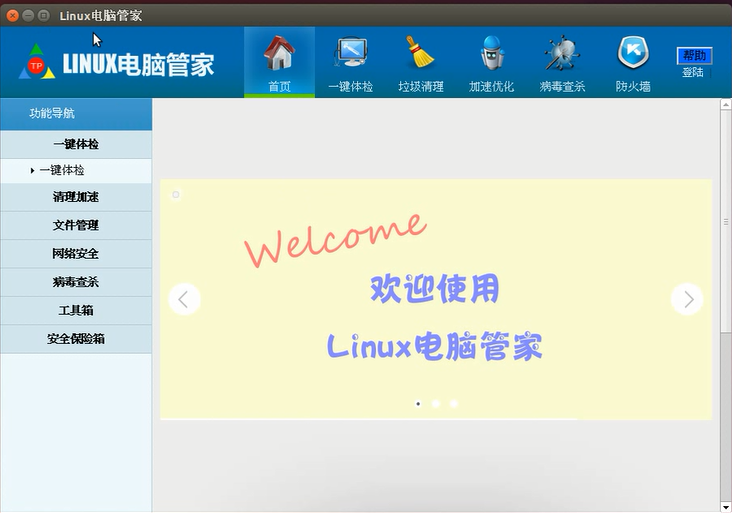

# Linux-Manager
项目简述：在Linux下用node-webkit环境开发linux安全管家软件，主要用到HTML5、CSS3、JavaScript、Linux shell、c语言等编程语言。 
功能描述：电脑基本信息、一键体检、垃圾清理、加速优化、进程管理、防火墙、网络流量监控、悬浮窗实时监控流量、文件备份、数据加密、病毒查杀、资料保护、黑名单、注册登陆。
首页

文件备份
登陆界面
一键体检
垃圾清理
加速优化
文件备份
数据加密
网络安全
病毒查杀
数据加密
进程管理
黑名单
